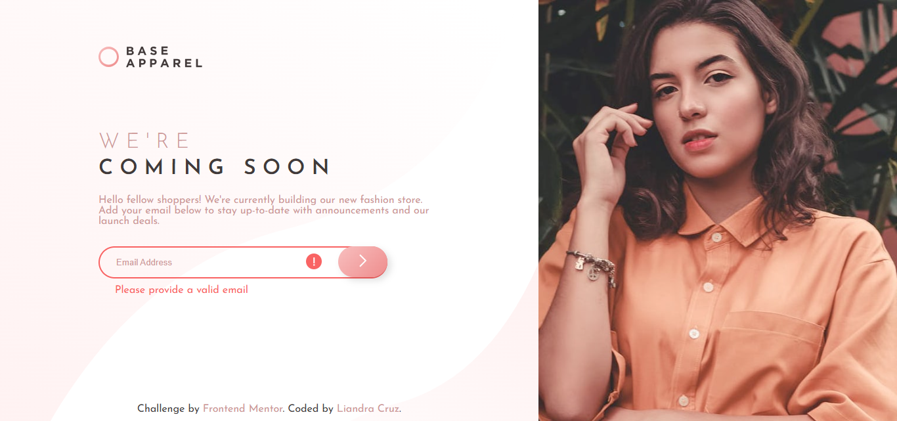

# Frontend Mentor - Base Apparel coming soon page solution

This is a solution to the [Base Apparel coming soon page challenge on Frontend Mentor](https://www.frontendmentor.io/challenges/base-apparel-coming-soon-page-5d46b47f8db8a7063f9331a0). Frontend Mentor challenges help you improve your coding skills by building realistic projects. 

## Table of contents

- [Overview](#overview)
  - [Screenshot](#screenshot)
  - [Links](#links)
- [My process](#my-process)
  - [Built with](#built-with)
  - [What I learned](#what-i-learned)
  - [Continued development](#continued-development)
  - [Useful resources](#useful-resources)
  - [AI Collaboration](#ai-collaboration)
- [Author](#author)

## Overview

### Screenshot

### Links

- Solution URL: [GitHub repository](https://github.com/liandracruz/frontend_mentor-challenges/tree/main/challenges/newbie/base-apparel-coming-soon-master)
- Live Site URL: 

## My process

### Built with

- Semantic HTML5 markup
- CSS custom properties
- Flexbox
- CSS Grid
- Mobile-first workflow
- JavaScript

### What I learned

Since I’m still a beginner on JavaScript this challenge was an excellent chance for me to practice my skills in the language. I used AI to generate a step-by-step guide to help me go through the process which made not just the process but also my understanding of the code itself much clearer.

### Continued development

Right now I’ll keep my focus on learning the fundamentals of JavaScript and practice as much as possible.

### Useful resources

- [W3Schools](https://www.w3schools.com/css/default.asp) - Was very helpful with some issues I had while trying to make the images response properly

### AI Collaboration

I used Google Gemini to help me find solutions for some CSS bugs I had, but the main role of this tool on this challenge was to help me get a bigger vision of the JavaScript so I wouldn’t get completely lost in the process.

## Author

- Linkedin - [Liandra Cruz](https://www.linkedin.com/in/liandra-cruz-971a32350/)
- GitHub - [@liandracruz](https://github.com/liandracruz)
- Frontend Mentor - [@liandracruz](https://www.frontendmentor.io/profile/liandracruz)
