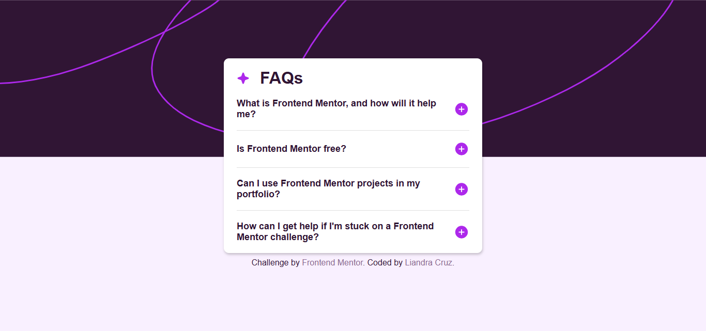
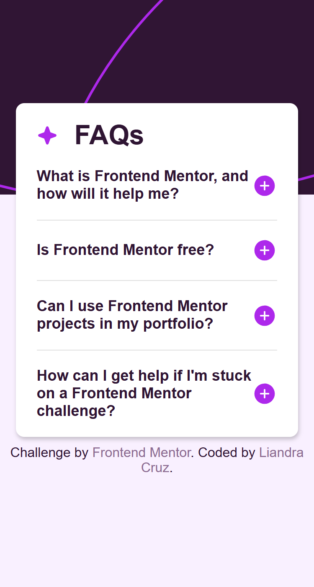

# Frontend Mentor - FAQ accordion solution

This is a solution to the [FAQ accordion challenge on Frontend Mentor](https://www.frontendmentor.io/challenges/faq-accordion-wyfFdeBwBz). Frontend Mentor challenges help you improve your coding skills by building realistic projects. 

## Table of contents

- [Overview](#overview)
  - [Screenshot](#screenshot)
  - [Links](#links)
- [My process](#my-process)
  - [Built with](#built-with)
  - [What I learned](#what-i-learned)
  - [Continued development](#continued-development)
  - [Useful resources](#useful-resources)
- [Author](#author)

## Overview

### Screenshot

### Links

- Solution URL: [GitHub repository](https://github.com/liandracruz/frontend_mentor-challenges/tree/main/challenges/newbie/faq-accordion-main)
- Live Site URL: [GitHub pages](https://liandracruz.github.io/frontend_mentor-challenges/challenges/newbie/faq-accordion-main/index.html)

## My process

### Built with

- Semantic HTML5 markup
- CSS custom properties
- Flexbox
- CSS Grid
- Mobile-first workflow
- JavaScript

### What I learned

This challenge was an amazing opportunity for me to practice JavaScript. Since I started studying JS very recently I used AI to guide me through the whole process and it was really good for me to have a clearer vision of how JavaScript works and how the code must be built.

### Continued development

Right now I’ll keep my focus on JavaScript in order to improve my code and logic skills without depending on AI.

### Useful resources

- [FreeCodeCamp](https://forum.freecodecamp.org/) - It's been a very helpful resource not just for this challenge but also for my JS studies in general.

## Author

- Linkedin - [Liandra Cruz](https://www.linkedin.com/in/liandra-cruz-971a32350/)
- GitHub - [@liandracruz](https://github.com/liandracruz)
- Frontend Mentor - [@liandracruz](https://www.frontendmentor.io/profile/liandracruz)
