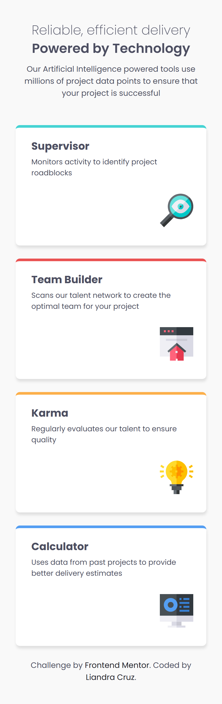
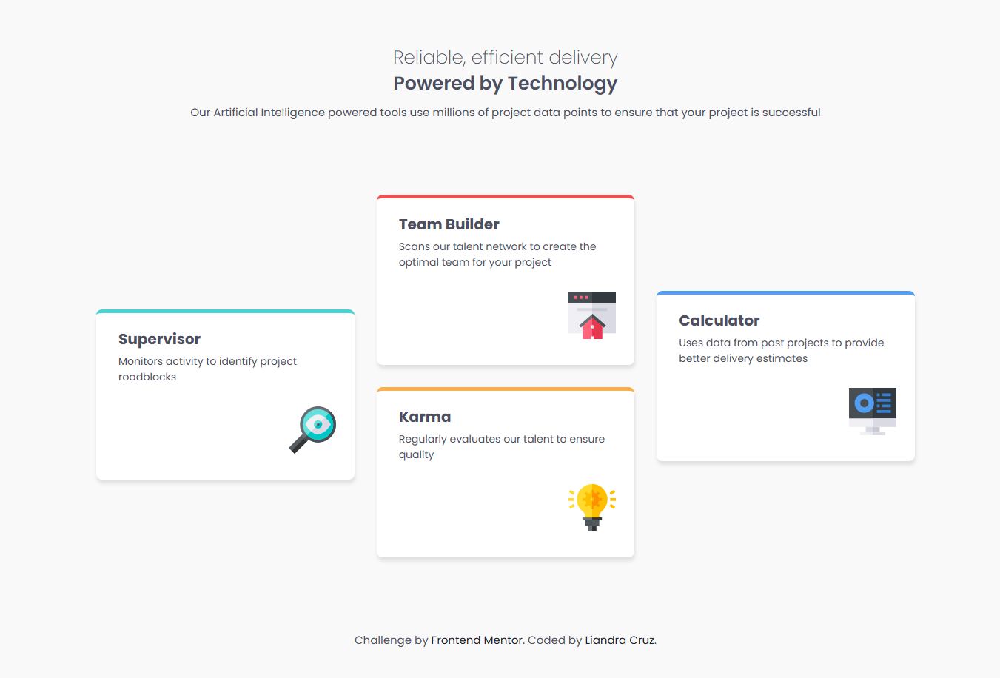

# Frontend Mentor - Four card feature section solution

This is a solution to the [Four card feature section challenge on Frontend Mentor](https://www.frontendmentor.io/challenges/four-card-feature-section-weK1eFYK). Frontend Mentor challenges help you improve your coding skills by building realistic projects. 

## Table of contents

- [Overview](#overview)
  - [The challenge](#the-challenge)
  - [Screenshot](#screenshot)
  - [Links](#links)
- [My process](#my-process)
  - [Built with](#built-with)
  - [What I learned](#what-i-learned)
- [Author](#author)

## Overview

### The challenge

### Screenshot

### Links

- Solution URL: [GitHub repository](https://github.com/liandracruz/frontend_mentor-challenges/tree/main/challenges/newbie/four-card-feature-section-master)
- Live Site URL: [Live project](https://liandracruz.github.io/frontend_mentor-challenges/challenges/newbie/four-card-feature-section-master/)

## My process

### Built with

- Semantic HTML5 markup
- CSS custom properties
- Flexbox
- CSS Grid
- Mobile-first workflow
- Media query

### What I learned

This challenge was a great opportunity to practice display grid, which was the main struggle on my last challenge. 

## Author

- Linkedin - [Liandra Cruz](https://www.linkedin.com/in/liandra-cruz-971a32350/)
- GitHub - [@liandracruz](https://github.com/liandracruz)
- Frontend Mentor - [@liandracruz](https://www.frontendmentor.io/profile/liandracruz)
