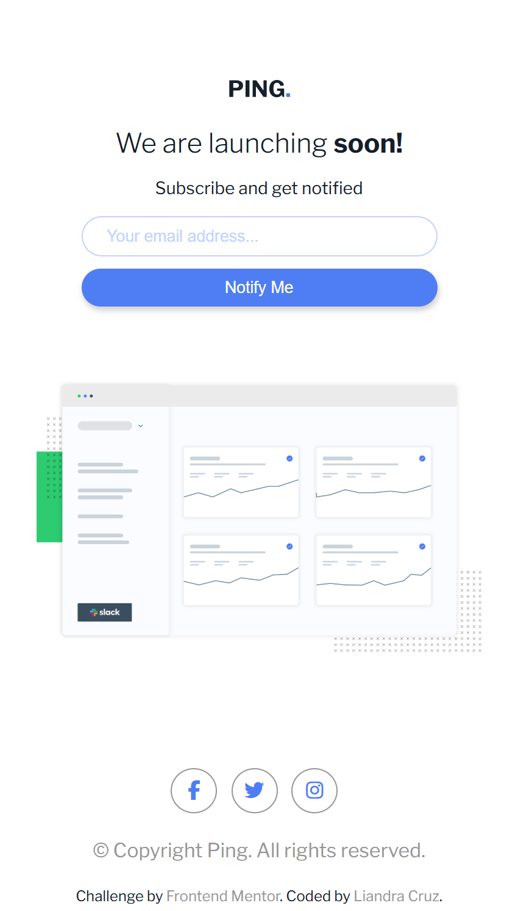
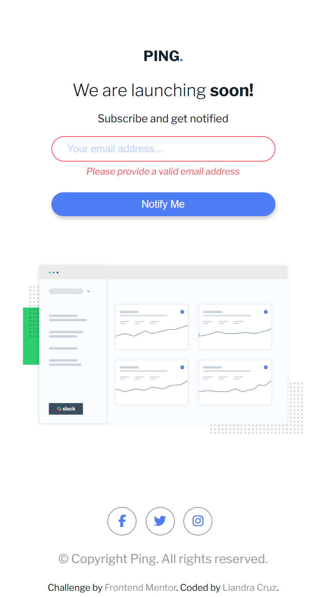
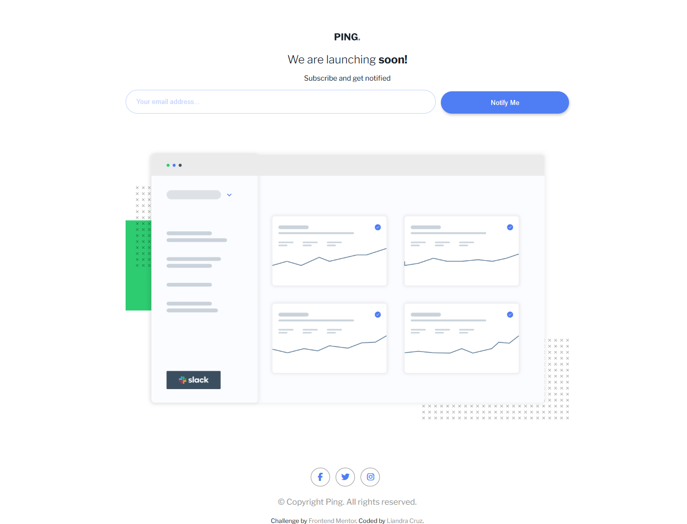
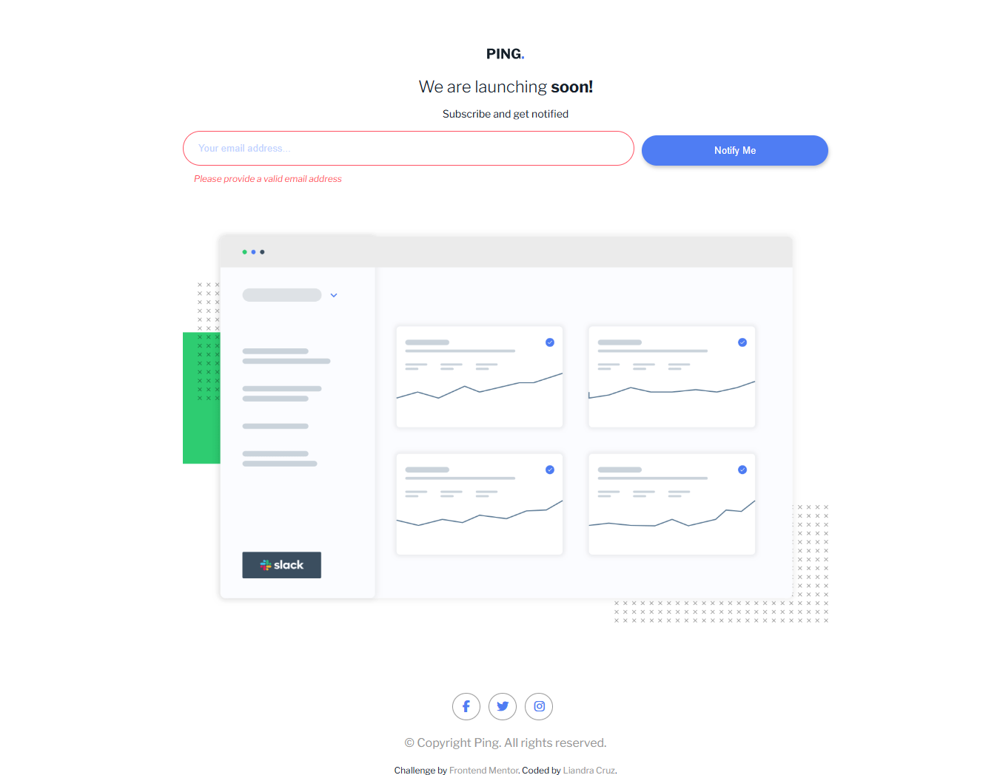

# Frontend Mentor - Ping coming soon page solution

This is a solution to the [Ping coming soon page challenge on Frontend Mentor](https://www.frontendmentor.io/challenges/ping-single-column-coming-soon-page-5cadd051fec04111f7b848da). Frontend Mentor challenges help you improve your coding skills by building realistic projects. 

## Table of contents

- [Overview](#overview)
  - [Screenshot](#screenshot)
  - [Links](#links)
- [My process](#my-process)
  - [Built with](#built-with)
  - [What I learned](#what-i-learned)
  - [Useful resources](#useful-resources)
  - [AI Collaboration](#ai-collaboration)
- [Author](#author)

## Overview

### Screenshot






### Links

- Solution URL: [GitHub repository](https://github.com/liandracruz/frontend_mentor-challenges/tree/main/challenges/newbie/ping-coming-soon-page-master)
- Live Site URL: [Website](https://liandracruz.github.io/frontend_mentor-challenges/challenges/newbie/ping-coming-soon-page-master/index.html)

## My process

### Built with

- Semantic HTML5 markup
- CSS custom properties
- Flexbox
- CSS Grid
- Mobile-first workflow
- JavaScript

### What I learned

I believe this was the challenge I liked to do the most so far. Since the JavaScript code of this challenge was very similar to the code of a previous challenge I made, I decided to add a new feature so I could practice a little more.

```JavaScript
    const emailInput = document.querySelector('#id-email');
    const btn = document.querySelector('button');
    const invalidEmail = document.querySelector('#invalid-email');
    const emptyInput = document.querySelector('#empty-input');
    const socialMediaElements = document.querySelectorAll('.sm-btn')

    btn.addEventListener('click', (event) => {
      const userEmail = emailInput.value;
      const emailRegex = /^[^\s@]+@[^\s@]+\.[^\s@]+$/;
      const isValid = emailRegex.test(userEmail);

      if(userEmail === "") {
        emptyInput.style.display = "block";
        invalidEmail.style.display = "none";
        emailInput.style.border = "1px solid #ff5263";
      } else if(!isValid) {
        invalidEmail.style.display = "block";
        emptyInput.style.display = "none";
        emailInput.style.border = "1px solid #ff5263";
      }
    });

    socialMediaElements.forEach((element) => {
      element.addEventListener('click', () => {
        alert('This element is for aesthetic purposes only.');
      });
    });
```

### Useful resources

- [Mozilla](https://developer.mozilla.org/pt-BR/docs/Web/CSS/Guides/Backgrounds_and_borders/Resizing_background_images) - This article helped me with some problems I had to make the image properly fit on the layout for bigger screens

### AI Collaboration

I used the Google Gemini as a tool to help me debug my code, which saved me a lot of time.

## Author

- Linkedin - [Liandra Cruz](https://www.linkedin.com/in/liandra-cruz-971a32350/)
- GitHub - [@liandracruz](https://github.com/liandracruz)
- Frontend Mentor - [@liandracruz](https://www.frontendmentor.io/profile/liandracruz)
