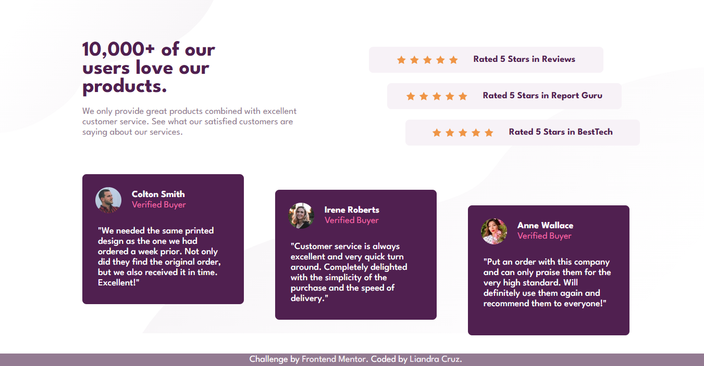
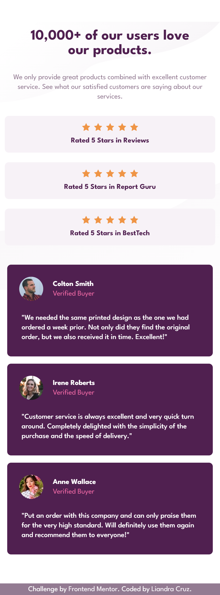

# Frontend Mentor - Social proof section solution

This is a solution to the [Social proof section challenge on Frontend Mentor](https://www.frontendmentor.io/challenges/social-proof-section-6e0qTv_bA). Frontend Mentor challenges help you improve your coding skills by building realistic projects. 

## Table of contents

- [Overview](#overview)
  - [Screenshot](#screenshot)
  - [Links](#links)
- [My process](#my-process)
  - [Built with](#built-with)
  - [What I learned](#what-i-learned)
  - [Continued development](#continued-development)
  - [Useful resources](#useful-resources)
  - [AI Collaboration](#ai-collaboration)
- [Author](#author)

## Overview

### Screenshot




### Links

- Solution URL: [GitHub repository](https://github.com/liandracruz/frontend_mentor-challenges/tree/main/challenges/newbie/social-proof-section-master)
- Live Site URL: [live website](https://liandracruz.github.io/frontend_mentor-challenges/challenges/newbie/social-proof-section-master/index.html)

## My process

### Built with

- Semantic HTML5 markup
- CSS custom properties
- Flexbox
- CSS Grid
- Mobile-first workflow

### What I learned

This challenge provided me with a better view of which are my main deficiencies on CSS. My biggest difficulty while making this challenge was how to make the mix of grid layout and flex work together on the media queries. Because of that I was forced to look for help not just in other resources but also using AI.
In spite of all those difficulties, something that I’m very proud of in this challenge is JavaScript code I developed with AI help to insert the stars icons on the rate bars. As a JS beginner this part of the project was really fun to create.

```js
const starsContainers = document.querySelectorAll('.star-container');
  starsContainers.forEach(container => {
    for(i = 0; i < 5; i++) {
      const starImg = document.createElement('img');
      starImg.src = 'images/icon-star.svg';
      starImg.alt = 'star icon';
      container.appendChild(starImg);
    }
  });
```

### Continued development

My next steps I believe are to increase the frequency and intensity of my logic and JavaScript studies, and to practice the grid layout so next time will be easier to develop projects like this.

### Useful resources

- [W3Schools - CSS](https://www.w3schools.com/css/default.asp) - Was a very useful source to solve some issues I had with grid layout, margin and padding.

### AI Collaboration

I used Google Gemini to help me solve the issues I had with CSS while trying to make the project responsive for bigger screens. I also asked for it to generate some parts of code, when any of my attempts didn’t work, and explain it to me.

## Author

- Linkedin - [Liandra Cruz](https://www.linkedin.com/in/liandra-cruz-971a32350/)
- Frontend Mentor - [@liandracruz](https://www.frontendmentor.io/profile/liandracruz)
- GitHub - [@liandracruz](https://github.com/liandracruz)
